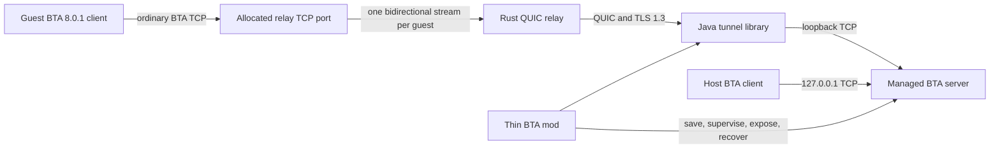

# Architecture

BTA Anywhere separates reusable networking from Minecraft integration. The relay and tunnel can be exercised without launching BTA; the mod coordinates save safety and process lifecycle.



## Rust relay

`bta-anywhere-relay` terminates guest TCP and host QUIC connections. Each registered session owns one public TCP listener because the BTA 8.0.1 handshake does not carry a routing hostname. The relay never parses BTA packets.

The first client-initiated bidirectional QUIC stream is the control stream. Every accepted guest becomes a server-initiated bidirectional stream with a framed `ConnectionOpen` header followed by raw bytes. Default limits are two sessions per token, three sessions per source address, eight active guests per session, and 30 new guest connections per minute per source address. Heartbeats, leases, and a 60-second in-memory grace window allow a disconnected tunnel client to reclaim its port while the relay process remains alive.

The admin listener exposes `/healthz`, `/readyz`, and `/metrics` on loopback by default. Metrics have no per-user, token, address, session, or connection labels.

## Java tunnel library

The `tunnel-client` project has no Minecraft dependency. Its public entry points are:

- `TunnelClient.open(TunnelConfig, InetSocketAddress)`
- `TunnelSession.endpoint()`, `state()`, `events()`, `closed()`, and `close()`
- `RelayDescriptor`, `RelayResolver`, `StaticRelayResolver`, `PublicEndpoint`, `TunnelState`, `TunnelEvent`, and redacted `Secret`
- `PortMappingService.open(PortMappingRequest)` and renewable `PortMapping`

Netty QUIC carries the control connection and guest streams. A stream connects to the configured local TCP target before reading payload, uses manual reads for backpressure, bounds the connection header to 64 KiB, and propagates half-closes in both directions. Reconnect delay is jittered exponential backoff from one to 30 seconds. A rejected stale resume token is discarded and followed by a clean registration.

`DefaultPortMappingService` discovers PCP, NAT-PMP, and UPnP gateways in that order. It rejects loopback, link-local, private, multicast, unspecified, CGNAT, and IPv6 unique-local results; renews at half of the reported lease; and unmaps on close. The backend boundary has deterministic protocol emulators in the test suite.

`RelayResolver` deliberately has only `StaticRelayResolver` in v0.1. There is no broker or region-selection API call.

## BTA mod

The client-only `btaanywhere` mod adds hosting and recovery screens. It calls BTA's normal save-and-unload path on the game thread and performs file/process/network work off-thread. Its state machine is:

```text
IDLE
  -> VALIDATING
  -> SAVING
  -> BACKING_UP | COPYING
  -> STARTING_SERVER
  -> WAITING_READY
  -> EXPOSING
  -> CONNECTING
  -> HOSTING
  -> STOPPING
  -> IDLE

Any active preparation/hosting state may enter FAILED and then STOPPING/recovery.
```

The managed server runs behind a small Java supervisor. The supervisor owns server stdin, writes a private authenticated loopback control file, and records both process identities. This lets a restarted client inspect or stop the exact managed process without guessing from a recycled PID. A recovery action validates PID, start time, and executable before acting.

Managed data lives under `<game-directory>/bta-anywhere/`:

```text
bta-anywhere/
  backups/              atomic live-world ZIPs; five per world
  showcases/            temporary or crash-retained copies
  downloads/            transient verified download files
  logs/                 server logs and private supervisor control files
  server/               extracted official server plus managed config/mod snapshot
  recovery.json         atomic lifecycle journal
```

The official server archive, saves, tokens, and generated certificates are runtime data and are never repository or release assets.

## World ownership invariant

Only one process may own a save:

1. The client validates while the single-player world is open.
2. The game thread invokes BTA's native world-close path, which saves, waits for chunk I/O, unloads, and closes storage.
3. Only then does the worker create a backup/copy and launch the server.
4. The host reconnects to the dedicated server as a multiplayer client.
5. The original world is reopened only after the dedicated server identity is no longer alive.

Backups are never restored automatically.
