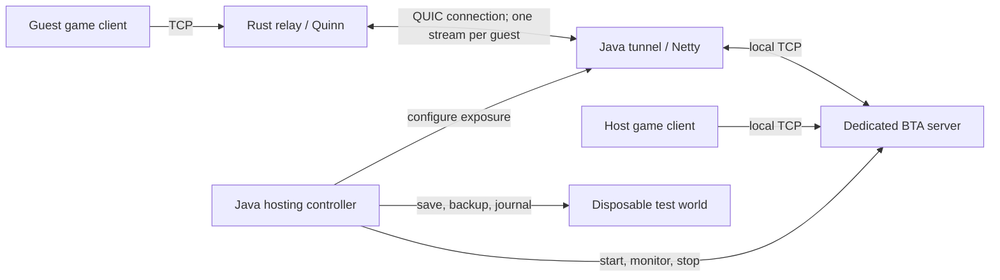

# Architecture and failure behaviour

BTA Anywhere has three parts: a Java game mod that manages a dedicated BTA
server, a reusable Java tunnel client, and a Rust relay built on Tokio and
Quinn. The game itself still uses TCP. QUIC carries the relay-to-host leg.

```mermaid
flowchart LR
    Guest[Guest game client] -->|TCP| Relay[Rust relay / Quinn]
    Relay <-->|QUIC connection; one stream per guest| Tunnel[Java tunnel / Netty]
    Tunnel <-->|local TCP| Server[Dedicated BTA server]
    Host[Host game client] -->|local TCP| Server
    Mod[Java hosting controller] -->|start, monitor, stop| Server
    Mod -->|configure exposure| Tunnel
    Mod -->|save, backup, journal| World[Disposable test world]
```

The diagram describes the legacy self-hosted relay path measured in the
benchmarks. LAN and direct modes bypass that relay. Additional encrypted join
and coordinator code exists, but these benchmark results do not validate those
paths or establish a hosted service. There is no public BTA Anywhere relay.

## World and process ownership

The mod validates the world, available disk space, local port and server
distribution before handing off. It closes the single-player world before
starting the managed dedicated server. A game-directory lease, recovery journal,
backup service and process identity checks keep ownership explicit. Live mode
must not reopen the original save while the managed server may still own it.
Failures retain recovery information instead of assuming that a vanished UI
means the server stopped. The host joins the server on loopback; leaving the
managed multiplayer world triggers a stop.

These mechanisms are implemented and have automated tests. The retained
[game journey](validation/2026-10-08-journey/README.md) reached server startup but
failed host authentication, so a successful two-player lifecycle and world
reopen remain separate acceptance gates.

## Transport and backpressure

The host initiates a certificate-verified QUIC connection to the relay and
registers with an access token. The relay allocates a public TCP endpoint. Each
accepted guest gets a bidirectional QUIC stream containing a framed connection
header followed by the guest's bytes. The Java side connects that stream to the
local game server. This lets a host make an outbound connection, but the relay
still needs a reachable UDP listener and public TCP ports.

QUIC streams provide independent ordered delivery, so loss affecting one stream
does not impose TCP's shared byte-order dependency on all guests. They still
share a connection's congestion control and flow-control budget. A degraded
congestion controller can therefore stall all guests. The guest-to-relay leg is
ordinary TCP; transport encryption on the host leg alone is not end-to-end game
encryption.

Java disables automatic reads on the paired sockets. Successful downstream
writes schedule the next upstream read. The local TCP socket uses the QUIC
connection's event loop, reducing cross-thread wakeups at the cost of sharing
one loop across that connection's guests. This trades scheduling overhead for
less per-connection CPU parallelism; benchmark improvements are workload and
machine specific.

Bytes arriving while local TCP connect is pending are retained in order, with
a 2 MiB cap per pending connection. Exceeding that cap fails the stream. Failed
connects, closed channels and rejected event-loop handoffs release retained
buffers. This fixes the previously reproduced race where a second payload
buffer closed an otherwise valid connection.

## EOF, limits and recovery

An input EOF shuts down only the opposite output direction, after the final
queued write completes. It does not prematurely discard a response. The
negotiated `streamEofBytes` control notice lets the relay check the expected
response byte count. A full socket close without an input EOF is not certified
as a complete response. Tests cover early half-close, delayed local connect,
failed writes and repeated concurrent transfers.

| Boundary | Current implementation | What it does not prove |
| --- | --- | --- |
| Framed control/header size | 64 KiB maximum | Total process memory is not capped at 64 KiB |
| Pending local-connect payload | 2 MiB per stream | All native and kernel buffers are not included |
| QUIC advertised receive credit | 16 MiB connection; 2 MiB bidirectional stream | Credit is not a process RSS bound |
| Relay guest concurrency | Eight connections per session by default | Eight-player gameplay capacity is unmeasured |
| Local TCP connect | Ten-second timeout | Existing application sessions cannot resume after a broken connection |
| Heartbeat expiry | Three configured intervals since last authenticated pong; monotonic clock | Detection time also depends on scheduling and transport progress |
| Reconnect backoff | Exponential, jittered, capped by configuration | Reconnection is retried; it is not a guarantee of service recovery |
| Pending EOF notices | 64 notices | This is one bounded queue, not a whole-system memory proof |

The relay also limits sessions, accepts, leases and resume grace. Default accept
rate is 30 per minute; synthetic campaigns raise only that rate to 10,000 so
short transaction tests do not measure admission throttling. Benchmark time
limits are observation budgets, not production guarantees. Results preserve
timeouts and partial progress; deadlines are not widened to obtain passes.

On relay failure the Java connection generation changes, old channels close,
and a new connection attempts registration. The recovery measurement requires
a fresh byte-verified transaction on the prior endpoint. It does not claim
that a Minecraft session, TCP socket or in-flight application transaction
survived the interruption. A player may need to reconnect.

## Evidence boundaries

The [loopback](benchmarks/2026-10-08/README.md),
[scaling](benchmarks/2026-10-08-scaling/README.md) and
[jitter diagnosis](benchmarks/2026-10-08-jitter/README.md) reports retain successful
and unsuccessful runs. The [Linux campaign](linux-netem.md) adds kernel network
impairment and independent sessions, with its execution status tracked in the
[validation checklist](validation-status.md). Synthetic bytes, kernel impairment,
and two-client gameplay answer different questions and must be reported separately.
