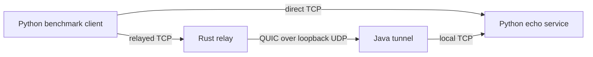

# Relay benchmark procedure

The [scaling and recovery follow-up](benchmarks/2026-10-08-scaling/README.md)
contains the 1/2/4/8/16-stream comparison, isolated local impairment matrix,
restart phase timings, profiler artifacts and reproduction commands.

Run on Windows x86-64 with JDK 21 and Rust 1.85 or later. The workload uses
synthetic bytes on loopback. It does not measure internet reliability or game
capacity. Keep the machine plugged in, its power scheme stable, and other load
low. Do not run builds or concurrent benchmark campaigns during measurement.



All four processes run on the same Windows machine. The controlled UDP fault
inserts a forwarding bridge between the relay and tunnel; it affects only that
benchmark's traffic. There is no external host or internet route in this setup.

## Build and identify the inputs

```powershell
.\gradlew.bat --no-daemon check build
cargo test --locked --all
cargo build --locked --release --package bta-anywhere-relay
python -m unittest discover -s scripts -p "test_benchmark*.py"

$relay = (Resolve-Path target/release/bta-anywhere-relay.exe).Path
$tunnel = (Resolve-Path tunnel-client/build/libs/bta-anywhere-tunnel-0.1.0-all.jar).Path
git rev-parse HEAD
git status --short
Get-FileHash $relay,$tunnel,scripts/benchmark_relay.py,scripts/benchmark_faults.py -Algorithm SHA256
powercfg /getactivescheme
```

Save these outputs and the exact build commands with the campaign. If the tree
is dirty, retain its patch and hashes of changed source files. The harness can
identify the containing checkout; that alone cannot establish which source
built an old executable. Freeze copies of each measured binary before editing
or rebuilding. Use the explicitly named shaded `all` JAR and release executable.

The release profile enables fat LTO, one codegen unit and symbol stripping.
The benchmark raises only its temporary loopback configuration's accept limit
to 10,000/minute. Production configuration defaults stay unchanged.

## Run sequentially

Choose a fresh directory for every campaign. Existing results are refused so
failed runs cannot be silently replaced.

```powershell
$run = 'benchmark-results/my-fresh-run'
python scripts/benchmark_relay.py --profile smoke --relay-binary $relay --tunnel-jar $tunnel --output "$run/smoke.json"
python scripts/benchmark_relay.py --profile full --relay-binary $relay --tunnel-jar $tunnel --output "$run/full.json"
python scripts/benchmark_faults.py --relay-binary $relay --tunnel-jar $tunnel --output "$run/faults.json"
python scripts/benchmark_relay.py --profile soak --soak-seconds 7200 --relay-binary $relay --tunnel-jar $tunnel --output "$run/soak.json"
```

Inspect each exit code and result before the next stage. A failed full run is
evidence, not a completed baseline. Isolate it with `diagnostic-eight-relay` or
`diagnostic-sequence`, using a fresh output path. Fix a reproduced defect, then
repeat the same workloads with recorded inputs. Repeat full campaigns on three
occasions where practical; keep their distributions separate.

If a failure occurs on the direct path, isolate the echo workload without either
project binary:

```powershell
python scripts/benchmark_direct.py --output "$run/direct-diagnostic.json"
```

This diagnostic runs five 60-second single-stream transfers with counters at
both socket ends. It uses the diagnostic echo command to expose those counters,
so it is a reproduction aid rather than a substitute for the original full run.

The smoke profile has one warm-up and three measured latency waves, then one
two-second throughput run per path/concurrency case. Full uses five warm-up and
30 measured waves, then five 60-second runs per case. Both cover 1 and 8 streams,
1 KiB/64 KiB/1 MiB requests, and independent request/response and half-close cases.
They also exercise relay restart, tunnel process restart, and a 55-second UDP
interruption. The fault supplement separately observes existing streams and
eight slow receivers. Neither surviving an old stream nor opening a fresh one
implies the other succeeded.

Fault schema 2 gives an existing stream a natural observation budget of 90 seconds,
configurable with `--existing-stream-observation-seconds` from 1 to 180 seconds.
For process termination the clock starts at fault onset; for a UDP drop it starts
at the actual scheduled forwarding gate restoration. JSON records both the
initial worker deadline and the deadline rebased to that gate. The socket already
waiting during a drop can retain its slightly earlier timeout for that read.
Natural EOF/reset, a deadline expiry, an unexpected local error and forced local
closure are distinct outcomes. A truncated observation or an unjoined worker fails
the case even when a fresh connection recovers. Natural interruption of an old
stream is an observation, not a claim that the stream survived. Natural terminal
latency uses the worker's terminal timestamp; total observation time can include
waiting for a separate fresh recovery probe. After observation, the gauge must
drain within the existing ten-second idle check. The relay's default QUIC idle
timeout is 30 seconds, so an earlier forced socket close cannot establish a leak.
Keep the original failed outputs and use fresh paths and recorded harness hashes
when repeating with a corrected observation window. Transfer-count denominators
cover slow receivers and fresh recovery attempts; existing-stream exchanges and
internal setup probes are reported separately.

Soak uses eight streams sending 64 KiB blocks with 0.5-second pacing, in waves
of up to 60 seconds, for two to four hours. It is sustained paced traffic, not
maximum throughput. Process/relay metrics are sampled during load and after
load stops. A sibling `.checkpoint.json` retains progress if the process dies;
the final JSON records orderly completion or a caught failure. Checkpoint
failure makes the run fail. Review memory after warm-up and during cooldown;
`PASS` alone is not proof that memory cannot leak.

## Interpret the evidence

- Latency is transaction completion time: TCP connect, transfer, byte verification
  and EOF. Report p50/p95 and sample counts. Concurrent streams within a wave are
  correlated; the small p99 estimates are exploratory.
- `relay_added_ms` is a distribution of paired relay-minus-direct samples. Its
  p95 is not the difference between independent path p95s.
- Throughput counts verified application payload in each direction, separately.
  Echoed traffic must not be added together and called one-way throughput. The
  rate denominator includes connection setup and drain through EOF. Schema 9
  starts the send-duration clock inside the sender thread; older schemas started
  it before connection setup. Disclose that difference in historical comparisons.
- UDP interruption is a local gate in a benchmark-owned bridge. Gate restoration,
  observer wakeup, and successful recovery have separate timestamps. Missing
  recovery is a failure, not a large successful recovery latency.
- Keep all failures, partial wave successes, byte/EOF errors, process exit records,
  hashes and bounded diagnostics. Do not publish temporary tokens, certificates,
  leases, full local paths or unrelated machine details.

Archive reviewed JSON and reports under `docs/benchmarks/` when publishing
evidence. Working outputs, binaries and credentials belong in ignored local
directories. CI retains benchmark output even when its smoke step fails.

The [2026-10-08 Windows loopback report](benchmarks/2026-10-08/README.md)
includes the completed full campaign, revised fault cases, two-hour soak,
memory review and retained original failures.
