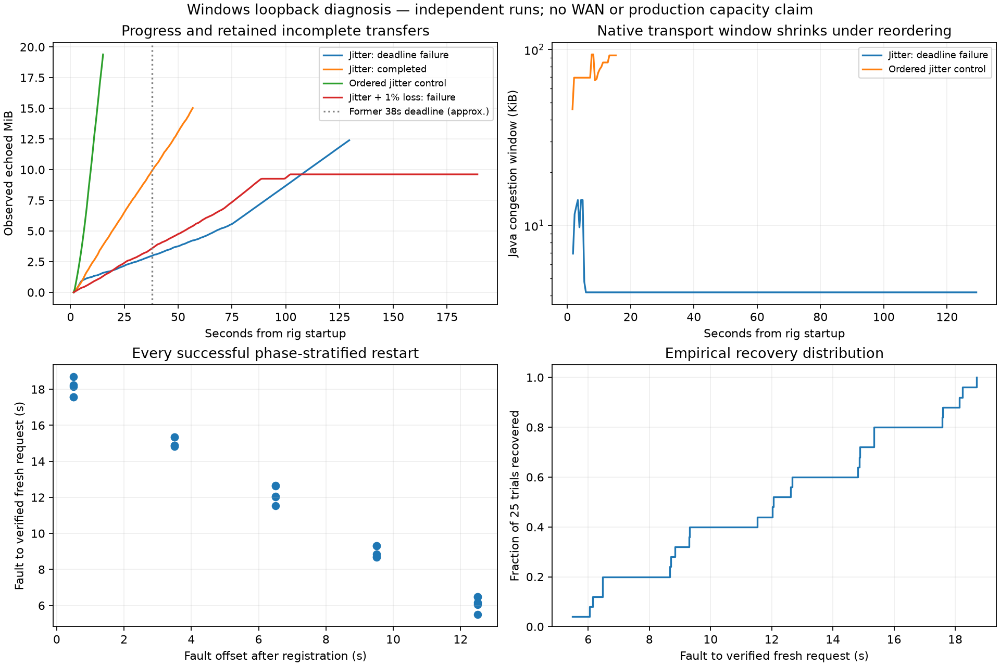

# Eight stream jitter diagnosis and restart distribution

Independent packet reordering under saturated load can severely degrade this
Windows loopback relay. One jitter-only run continued progressing but missed a
128-second total transfer deadline; another completed all eight streams in
55.88 seconds. Two controls that retained jitter while preserving packet order
completed all eight streams in about 14 seconds. Paced traffic passed both jitter
and jitter plus 1% loss. These controls implicate the interaction of reordering,
offered load and transport recovery. They do not identify a specific native-code
defect or establish a production fix.

The extended jitter-plus-loss run exposed an additional failure: aggregate echoed
bytes stopped advancing around 102 seconds, the heartbeat expired around 151
seconds, and seven original transfers reached their 188-second deadline. The
connection re-registered, but the old application transfers did not recover.

The separate restart campaign recovered **25/25** times,
with **12.05s median**, **18.22s p95**, and
**5.49–18.69s range**.
It deliberately varies fault phase and supersedes the earlier three-trial sample
as the stronger description of current clean-bridge restart recovery.



## Saturation and controls

| Condition | Completed streams | Last successful transfer | Reconnect attempts |
|---|---:|---:|---:|
| [Jitter, saturated, 120s drain](results/jitter-saturated.json) | 1/8 | 107.23s | 0 |
| [Jitter, saturated, 180s drain](results/jitter-saturated-180.json) | 8/8 | 55.88s | 0 |
| [Ordered jitter control, saturated](results/jitter-ordered.json) | 8/8 | 13.98s | 0 |
| [Ordered jitter control, repeat](results/jitter-ordered-repeat.json) | 8/8 | 14.48s | 0 |
| [Jitter, paced 4 KiB every 100ms](results/jitter-paced.json) | 8/8 | 8.83s | 0 |
| [Jitter + 1% loss, saturated, 180s drain](results/loss-saturated.json) | 1/8 | 72.61s | 2 |
| [Jitter + 1% loss, paced 4 KiB every 500ms](results/loss-paced.json) | 8/8 | 8.05s | 0 |

Each cell starts fresh relay, Java and bridge processes. All use eight independent
TCP echo streams and an eight-second sender budget. A blocked send may finish
after that budget; all time spent sending and draining remains inside the
absolute budget plus drain deadline. Successful streams require nonzero exact
bytes and EOF. Failed streams retain per-endpoint byte counters and errors and
receive no successful throughput value. The last-success column includes a
partial success in a failed cell; it is not the duration of that whole cell.

The saturation workload uses seeded 64 KiB blocks. Pacing changes both block size
and offered rate, with the settings shown above; these are load controls, not
equivalent throughput comparisons. The ordering control clamps each departure
deadline to the preceding deadline in that direction. It therefore changes the
departure distribution as well as removing reordering. The bridge counts packets
forwarded behind a newer ingress sequence independently in each direction.

These diagnostic cells begin after registration without the earlier matrix's
transaction warmup. All diagnostic binaries are identical across these cells,
but differ from the milestone binaries by opt-in instrumentation. They use
independent, scheduler-dependent packet arrival sequences. The two saturation
runs cannot be treated as a matched demonstration that extending the deadline
fixes the problem: the 180-second-allowance run happened to finish within 56
seconds, whereas the other was still incomplete at 128 seconds.

## What the telemetry establishes

In the failed jitter-only run, aggregate received bytes advanced in every roughly
half-second sample interval. Each echo endpoint received and wrote its entire
request before the final deadline. The Java native transport reported a median
congestion window of **4267 bytes**, **653 packets carrying retransmissions** and
**674402 retransmitted stream bytes** at its final sample. Of 1354 stream samples,
1308 reported zero writable capacity; pending application writes peaked at
64 KiB per stream. Quinn reported 932 lost packets and 570 congestion events.
The bridge peaked at 22086 queued bytes with no overflow or intentional loss.

This is sustained slow progress with pressure in the return path. The native
Java RTT estimate rose to roughly 123 seconds, while Quinn's final RTT estimate
was about 31ms. That discrepancy is retained as an unresolved transport anomaly;
it is not presented as the achieved network RTT. The pinned Netty API defines
[RTT in nanoseconds and congestion window in bytes](https://github.com/netty/netty-incubator-codec-quic/blob/5ac67b8489f512c5d302fdee864c53e6f04300d5/codec-classes-quic/src/main/java/io/netty/incubator/codec/quic/QuicConnectionPathStats.java).

The failed jitter-only run's p99 scheduled-task lateness was about 15ms for Java
and 16ms for Tokio. These samples reveal no seconds-long event-loop pause.
They include Windows timer granularity and are not pure CPU scheduling delay.
Bridge overflow counters do not measure operating-system socket drops.

The successful unpaced jitter run still incurred 9570 native lost-packet
declarations and 8294 packets carrying retransmissions. The same nominal
impairment can therefore produce quite different recovery behavior. The ordered
controls and successful paced cases narrow the trigger, but do not prove which
loss declarations were spurious or why one native RTT estimate diverged.

Under jitter plus 1% loss, the extended run recorded two reconnect attempts
following heartbeat expiry, including the rejected stale resume and eventual
registration. Seven streams made no further receive progress for about 87 seconds
before timeout. Native and Quinn counters reset on replacement connections;
the raw samples and lifecycle timeline must be read together, not subtracted
across reconnections as if they belonged to one connection.

Diagnostics are off by default. `BTA_TRANSPORT_PROFILE=1` enables half-second
Quinn congestion, RTT, loss, flow-control-frame and UDP counters.
`-Dbta.transportProfile=true` enables native Java connection statistics, scheduled
task lateness, per-stream read/write totals, pending write bytes and writable
capacity. Netty's writable capacity is a transport admission signal, not an
independent measurement of the peer's absolute advertised stream-credit limit.
The counters distinguish blocked frames and credit-update frames, but do not
justify attributing the whole problem to flow control.

## Restart recovery across heartbeat phases

Each trial uses a fresh session and the **frozen milestone binaries**, with a
zero-impairment userspace bridge and one second of relay downtime. The five
target offsets after registration are repeated five times in seeded shuffled
order. The reference is Python's observation of registration, shortly before
the Java heartbeat is scheduled; it is not an independently captured packet
timestamp. Actual offsets and every retry remain in
[the raw 25-trial result](results/restarts-25.json).

| Target fault phase after registration | Trials recovered | Median recovery | p95 recovery |
|---|---:|---:|---:|
| 0.5s | 5/5 | 18.14s | 18.60s |
| 3.5s | 5/5 | 14.89s | 15.34s |
| 6.5s | 5/5 | 12.05s | 12.66s |
| 9.5s | 5/5 | 8.84s | 9.31s |
| 12.5s | 5/5 | 6.15s | 6.47s |

Recovery ends at a new byte-exact request and EOF, not merely process startup or
registration. Early faults wait longer for the next 15-second heartbeat to elicit
an authenticated reset. Retry backoff and the stale resume-token attempt add
further time. The pooled quantiles describe these equally weighted phase strata
on this machine, not the natural frequency of failures on a deployed network.
With 25 samples, p95 is descriptive and is not a tail-latency guarantee.
Existing application streams are not claimed to survive relay restarts.

## Reproduction and evidence

Use fresh output paths and the artifact SHA-256 values retained in each JSON.
No builds or tests ran concurrently with these measurements. The archive includes
the initial sampler and bridge source revisions as well as the final sources.
`verify_archive.py` checks every archived result and source hash, workload source
identity, successful byte/EOF checks, the phase schedule, and the recovery
binaries' identity against the earlier milestone.

```powershell
python scripts/benchmark_jitter_diagnostics.py --relay-binary <instrumented-relay.exe> --tunnel-jar <instrumented-tunnel.jar> --output <fresh.json> --drain 180
python scripts/benchmark_jitter_diagnostics.py --relay-binary <instrumented-relay.exe> --tunnel-jar <instrumented-tunnel.jar> --output <fresh-paced.json> --block-kib 4 --pace-ms 100
python scripts/benchmark_jitter_diagnostics.py --relay-binary <instrumented-relay.exe> --tunnel-jar <instrumented-tunnel.jar> --output <fresh-ordered.json> --ordered
python scripts/benchmark_restart_distribution.py --relay-binary <milestone-relay.exe> --tunnel-jar <milestone-tunnel.jar> --output <fresh-restarts.json>
python docs/benchmarks/2026-10-08-jitter/verify_archive.py
```

The complete check names and exit codes are in [validation.json](results/validation.json),
with the command output in [validation.txt](results/validation.txt).

Linux netem remains pending. The current `wsl --list --quiet` check hung without
returning a distribution list; its owned processes were terminated. The earlier
campaign's Windows registration error is a separate observation. No kernel netem
results are inferred from this bridge, which still has substantial scheduling
overhead. A Linux repetition also requires a Linux-native Java QUIC artifact;
the present dependency includes the Windows native binary.

## Application claim and next investigation

Later on 8 October, the [packet investigation](../2026-10-08-packets/README.md)
captured the RTT divergence and evaluated a native dependency update, and the
[Linux campaign](../2026-10-08-linux/README.md) ran on hosted infrastructure.
The pending statements above describe this earlier archive's state; its failed
experiments and source artifacts remain unchanged.

The [38% median eight-stream loopback throughput improvement](../2026-10-08-scaling/README.md)
remains the strongest measured performance headline. The new instrumented cases
do not change that matched comparison. For recovery, use the 25-trial distribution
above instead of presenting the old 5.4-second three-trial median as typical.

The next transport investigation should capture packet-level ACK/loss and send
timestamps around the divergent native RTT estimate, and repeat saturation with
Linux netem. Pacing and preserving order demonstrate useful controls here;
neither is silently introduced as a production fix, and no timeout or heartbeat
is relaxed to relabel the failed transfers as successful.
