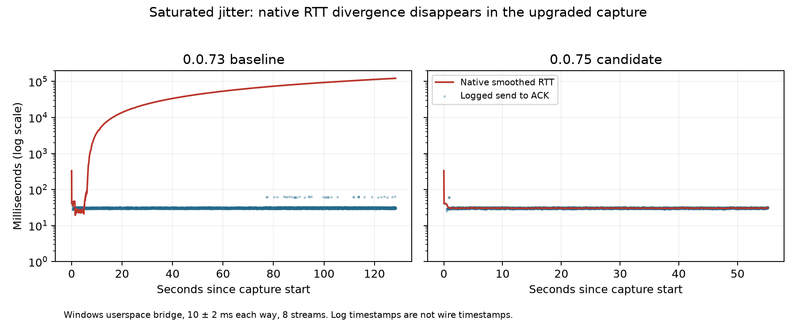

# Packet-level diagnosis and native QUIC update — 8 October 2026

The old Windows native transport can calculate an RTT exceeding two minutes
while the same packet log shows about 31 ms between sending a packet and
receiving its ACK. Updating Netty's native QUIC dependency from `0.0.73.Final`
to `0.0.75.Final` removes this divergence in the two retained captures and
completes all eight byte/EOF-verified streams in each captured workload.
Without qlog, the candidate passed **6/6 sessions and 48/48 streams**, compared
with **1/6 sessions and 10/48 streams** for the baseline. Failed cells and their
partial successes remain in the archive.

This is one evidence-led production fix experiment: a dependency upgrade.
Packet logging and the standalone pacer experiment are diagnostic controls,
not additional production fixes. Neither timeouts nor flow-control credit
were enlarged. No application buffering or EOF logic changed in this fix.

## Packet evidence and mechanism

Each qlog ACK is matched to the largest acknowledged packet number in the same
packet-number space. The analyzer associates an RTT update only with a nearby
ACK event and records exact source lines. These are native log timestamps,
not an independent wire capture. ACK delay, native batching and log overhead
limit interpretation of small differences; they do not explain a discrepancy
of two minutes. The analyzer reports missing matches and truncated final records.

| Capture | Matched RTT updates | Updates differing by more than 100 ms | Maximum native smoothed RTT | Median logged send-to-ACK interval |
| --- | ---: | ---: | ---: | ---: |
| Baseline, jitter | 4,491 | 4,198 | 122,229.59 ms | 30.63 ms |
| Baseline, jitter + loss | 2,864 | 2,846 | 95,064.98 ms | 30.59 ms |
| Candidate, jitter | 3,581 | 0 | 333 ms, including initialization | 30.45 ms |
| Candidate, jitter + loss | 3,428 | 0 | 333 ms, including initialization | 30.57 ms |

The worst jitter-baseline example is 1-RTT packet 17,483: its send is logged at
128,374.50 ms and ACK at 128,405.37 ms, an interval of 30.87 ms. The associated
native latest RTT is 122,414.79 ms and ACK delay is 0.017 ms. The exact qlog
line numbers are 82,905, 82,908 and 82,909. The loss-baseline capture has one
incomplete final JSON record; the analyzer excludes and explicitly flags it.
The harness allows ten seconds for graceful tunnel stop before forced
termination. Its original diagnostic schema did not serialize per-process
cleanup outcomes; this archive therefore does not establish graceful cleanup
for that failed cell. The current harness records those outcomes and treats
unclean shutdown as failure. No complete final trace is claimed.



The native `0.0.73` Maven POM pins Cloudflare quiche commit
`70d6d3e233568e906e66179a56c93cf9b0616899`. Its
[congestion code](https://github.com/cloudflare/quiche/blob/70d6d3e233568e906e66179a56c93cf9b0616899/quiche/src/recovery/congestion/mod.rs)
stores the pacer's next-send timestamp as the packet's send time. Below the
initial congestion window it passes zero bytes into the pacer. The
[pacer](https://github.com/cloudflare/quiche/blob/70d6d3e233568e906e66179a56c93cf9b0616899/quiche/src/recovery/congestion/pacer.rs)
can retain an old timestamp until its capacity/rate interval expires. An
inflated RTT reduces the computed pacing rate, extending that interval: a
plausible self-reinforcing timestamp error supported by the observed trace.

The `0.0.75` POM pins quiche `4f347477006bf7f928335d28f05056013f70b87e`.
Its [corresponding send path](https://github.com/cloudflare/quiche/blob/4f347477006bf7f928335d28f05056013f70b87e/quiche/src/recovery/congestion/mod.rs)
records the supplied current send time. The release includes other upstream
changes, including native dependencies. The matched upgrade therefore does
not uniquely attribute every improvement to one line or establish that no
other release change matters. Netty core remains pinned to `4.1.122.Final`;
the tested application did not upgrade all Netty modules together.

The standalone Rust timestamp reproducer uses the unchanged old upstream
pacer, a low fixed congestion window, synthetic 31 ms ACK intervals and a
120-second synthetic clock. It compares the old timestamp choice with recording
the current send time. It is a minimal mechanism check, not a reimplementation
of QUIC loss recovery or a substitute for native integration measurements.
It passed its assertions: the old timestamp produced a 120,031 ms latest RTT
and 119,961 ms smoothed RTT; the current-time control stayed at 31 ms for both
([output](results/pacer-reproducer.json)).

## Matched comparisons

All Windows cells use the same frozen Rust executable and Java application
source, an eight-second send budget, eight streams, 64 KiB blocks, and the
existing 120-second drain allowance. The absolute send-plus-drain budget is
128 seconds; process startup and bounded teardown add to reported wall time.
Every completed transfer verifies reply contents, nonzero byte counts and EOF.

The userspace bridge applies nominal 10 ms delay with independent ±2 ms jitter
per direction; the loss condition also applies nominal 1% loss. Independent
departure scheduling allows reordering. Actual scheduling is coarser on Windows.
The bridge is neither Linux netem nor a WAN, and identical seeds do not produce
identical packet replay when packet arrival schedules differ.

Two captured baseline/candidate comparisons use seed 1701. The follow-up uses
three fresh-process pairs per condition with seeds 1701, 1702 and 1703, alternating
baseline-first and candidate-first order by seed. Native qlog is disabled in
those twelve cells; the lighter connection/stream telemetry remains enabled
equally on both versions. These controls check that the outcome is not confined
to packet-logged runs. They do not estimate qlog's timing overhead precisely.
No local build, test suite or other benchmark ran during the paired campaign;
source editing and ordinary desktop activity continued. Linux and Windows CI
ran on separate hosted machines.

Sending is time-bounded rather than a fixed-byte workload, so admitted volumes
differ. Do not call the difference in total wall time a throughput speedup.
Eight streams in one session are correlated; the session, not each stream, is
the independent repetition. The old failure is intermittent.

| Condition / seed | Baseline completed streams | Candidate completed streams | Baseline maximum sampled RTT (s) | Candidate maximum sampled RTT (ms) |
| --- | ---: | ---: | ---: | ---: |
| Jitter / 1701 | 0/8 | 8/8 | 126.88 | 33.82 |
| Jitter / 1702 | 8/8 | 8/8 | 88.80 | 31.21 |
| Jitter / 1703 | 1/8 | 8/8 | 123.85 | 31.12 |
| Loss / 1701 | 0/8 | 8/8 | 74.70 | 33.50 |
| Loss / 1702 | 1/8 | 8/8 | 88.73 | 33.09 |
| Loss / 1703 | 0/8 | 8/8 | 87.63 | 31.11 |

The one successful baseline still exhibited an 88.80-second RTT estimate before
completing. The upgrade improves both the observed estimator behaviour and
completion outcomes in this small sample. Candidate cells verified 98,238,464
payload bytes in each direction; baseline completed streams verified 18,743,296.
Partial bytes from failed streams are retained as diagnostics and excluded
from completed-byte totals. Candidate wall times ranged from 62.05–87.46 s;
these are total run durations, not a guarantee that all data drains in eight seconds.

## Regression and compatibility checks

The candidate Java check/build passed with **122 tests passed, four skipped**
and no failures/errors. The local Python suite passed **97 tests**. The final
bundled tunnel and mod built successfully, and the final native `doctor` check
passed. A new cleanup smoke passed; a deliberate known-invalid-JAR startup
check remained FAILED as expected and recorded all owned processes stopped.
Relay termination is deliberate and can have a nonzero exit; it is not described
as graceful. See [structured checks](results/validation.json).

[Windows CI 37837653925](https://github.com/Kxnar/bta-anywhere/actions/runs/37837653925)
passed attribution, Rust, Java/native QUIC and integration jobs. Integration
includes 100 concurrent byte-exact waves, 100 serial half-close iterations and
the existing direct/relay/fault smoke. Run metadata and full logs are archived.
The separate [Linux report](../2026-10-08-linux/README.md) records nine passing
netem sessions. None of these checks establishes successful game authentication.

## Retained failures and limits

The first capture smoke used a JAR copied before its shadow build finished.
Java rejected that incomplete file before registration. Its failed result and
binary hash remain in the archive. The completed build was separately frozen,
checked with `doctor`, and used for all transport comparisons. This preparation
error is not counted as a transport failure.

All failed baseline cells, partial successes, transfer errors and the truncated
loss capture remain retained. Previous pacing, ordering, longer-drain and direct
TCP failures remain in the older reports. This upgrade does not explain the
historical direct-path Windows reset, demonstrate gameplay, validate NAT traversal,
or establish reliability outside the measured profiles. The native-log RTT
evidence is not a pcap. The Linux campaign is reported separately; its conditions
and hardware differ and its samples are not pooled with these comparisons.

## Reproduce and verify

`archive-index.json` hashes every frozen result, capture and source snapshot.
Qlog files are gzip-compressed without editing their events; original and
compressed hashes are retained. Home paths in logs are redacted. Failed results
are never discarded. The archive identifies the measured JAR and executable
hashes without redistributing those binaries.

For the exact measured baseline source, use checkout `7226336` plus
`source/baseline-source.patch`. Build the completed JAR before copying it. For
the candidate, change only the native QUIC version to `0.0.75.Final`, refresh the
two project lockfiles with `--write-locks`, and build again. Preserve the native
Windows classifier and Netty core version. Release Rust source is unchanged.
`source/measured` contains the exact harness bytes used, independent of current
checkout line endings. Runtime binaries can differ in ZIP/build metadata after
a fresh build; the frozen hashes identify the original measured artifacts.

```powershell
python scripts/benchmark_jitter_diagnostics.py --relay-binary <release-relay.exe> --tunnel-jar <completed-baseline.jar> --condition jitter-10ms-2ms --seconds 8 --drain 120 --streams 8 --seed 1701 --qlog --output <fresh-baseline.json>
python scripts/benchmark_jitter_diagnostics.py --relay-binary <release-relay.exe> --tunnel-jar <completed-candidate.jar> --condition loss-10ms-2ms-1pct --seconds 8 --drain 120 --streams 8 --seed 1701 --qlog --output <fresh-candidate.json>
python scripts/benchmark_transport_pairs.py --relay-binary <release-relay.exe> --baseline-jar <completed-baseline.jar> --candidate-jar <completed-candidate.jar> --output-directory <fresh-directory>
python scripts/verify_packet_evidence.py docs/benchmarks/2026-10-08-packets
rustc scripts/reproduce_pacer_timestamp.rs -o <temporary-output.exe>
```

Run the last executable to exercise the synthetic timestamp assertions. The
packet verifier checks hashes, rederives the saved RTT interpretations from
compressed captures, validates matched cell identities and verifies all claimed
successful byte/EOF outcomes. It does not turn unsuccessful cells into passes.
