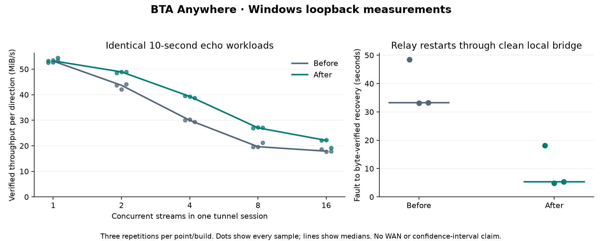

# Connection scaling, local impairments and restart recovery

The matched eight-stream median increased from **19.65 to 27.04 MiB/s (+37.6%)**,
with **65.6% less Java CPU per verified MiB**. Single-stream throughput was
essentially unchanged: **53.16 to 53.24 MiB/s**. The original scaling collapse
reproduced at 1, 2, 4, 8 and 16 streams; this fresh baseline is distinct from the
historical 59.34 / 24.68 MiB/s observation.

Clean-bridge relay restart recovery fell from **33.19 to 5.37 seconds (-83.8%)**,
medians of three faults. All samples are shown: **33.09–48.52 seconds before**
and **4.88–18.15 seconds after**. The small sample and packet/heartbeat phase
preclude a general five-second recovery guarantee.

The final matched measurements are in [results.md](results.md). Concurrent
throughput still declines: the change removes a measured scheduling cost,
without claiming to solve the whole scaling curve.



This follow-up measures synthetic, byte-exact echo traffic on one Windows desktop.
It does not establish WAN capacity, player capacity, or performance across multiple
independent host sessions. Linux `tc netem` testing is **pending**: WSL failed with
`REGDB_E_CLASSNOTREG`, and the user chose a bounded local UDP impairment bridge.

## Changes and diagnosis

The legacy-mode Java bridge previously registered the local TCP socket on an arbitrary worker
from the event-loop group. Its paired QUIC stream belongs to the QUIC connection's
event loop. Each payload write and the next manual read could therefore require
cross-thread queueing and wakeups. The candidate registers the TCP socket on its
paired QUIC event loop. Independent QUIC sessions can still use different loops.
Manual-read backpressure, stream credit, pending-connect bounds and EOF ordering
remain in place. Serializing a session's TCP and QUIC work reduces wakeups but also
puts that session's TCP processing on the connection's loop; this is a trade-off,
not a claim that one thread is always preferable.

Restart recovery uses authenticated QUIC stateless resets. The relay derives a
domain-separated reset key from its existing private TLS key using HKDF-SHA256.
The default Quinn connection-ID generator rejects pre-restart IDs because its
validation key changes. Random 128-bit IDs allow a restarted relay to reach the
reset path; Quinn still limits reset frequency and response size. Rotating or
re-encoding the private key changes reset authentication, so existing clients
fall back to normal failure detection. There is no extra secret file to manage.

A trace then showed that the relay sent resets but the Java codec discarded
their random-looking destination IDs before native QUIC could authenticate them.
Each session already owns a separate UDP socket and exactly one QUIC connection.
Using a zero-length client connection ID allows the native quiche implementation
to receive and authenticate resets. Active migration is disabled: a changed
endpoint requires reconnection. Reset tokens are still authenticated by native
QUIC; the live negative test injects 64 unauthenticated reset-shaped packets and
checks continued byte-exact transactions. Protocol rationale:
[RFC 9000 stateless reset](https://www.rfc-editor.org/rfc/rfc9000.html#name-stateless-reset).

The original 15-second heartbeat interval and retry backoff remain. Deadline
checks now use monotonic time. The earlier three-second heartbeat candidate is
**rejected**: although clean restart recovery improved, its nine-second deadline
caused an early reconnect during saturated jitter testing. Its measurements are
retained as an experiment, not the final result. A restart reset usually arrives
after the next normal heartbeat; fault phase therefore still matters.

Measured ablations, including unsuccessful ones, are retained. Isolating the Python
clients and then both clients and echo connections into separate processes did not
restore the original throughput. A single Java event loop improved
the concurrent case and reduced Java CPU consumption. Batching `flush()` calls
did not improve that result and was removed. A single Tokio worker produced mixed
results and was not adopted. One initial Netty property experiment was ineffective
because shading relocates the property name; the corrected experiment uses the
relocated name recorded in its JSON.

Java Flight Recorder samples and Python call profiles were collected separately
from the final comparisons. Samples in native socket waits are not CPU percentages.
Python 3.14's profiler observes overlapping thread activity, so its cumulative call
trees cannot safely be treated as thread-specific CPU attribution. Windows WPR
could not enable its profiling policy (`0xc5585011`); native Rust stack attribution
is unavailable. Relay CPU time and opt-in Quinn statistics provide a narrower
view. Post-transfer snapshots reported zero connection/stream blocked frames,
nonzero loss, and increasing RTT with concurrency. They do not prove that flow
control or copying never affects throughput. The pending-connect copy path is
bounded and precedes steady-state forwarding; it was not changed.

## Workload and provenance

The final comparison uses the same harness and workload, with separately hashed
original and final release binaries,
64 KiB seeded payloads, byte verification, EOF requirement, and connection/drain
timing. Each concurrency (1, 2, 4, 8, 16) has three ten-second repetitions on both
direct and relay paths. Stream counts and path order reverse on alternating
repetitions. Throughput is verified bytes **per direction** divided by whole-wave
wall time, including scheduling, connect and drain; the historical maximum-stream
denominator is also retained as `legacy_mib_s`. Echo traffic is not double-counted.
The first run includes JVM warmup; three repetitions are a small sample, not a
confidence interval or a long soak.

Only the benchmark's temporary configuration raises the per-session connection
limit from 8 to 32. Production still defaults to 8. The initial 16-stream run that
hit the production limit is retained as a failure, not classified as throughput.
Direct-path throughput controls help identify harness limitations. CPU accounting
uses Windows process CPU seconds; the process-worker experiment's parent Python
CPU excludes child workers and must not be compared as total harness CPU.

The instrumented baseline JAR changes lifecycle logging only (disabled during
scaling). Original artifacts match the earlier campaign's recorded SHA-256 values.
The final JAR contains event-loop placement, reset dispatch and monotonic deadline
changes. The final relay contains reset persistence and opt-in diagnostics.
No builds or tests run concurrently with performance measurements.
Hashes, raw results, retained failures and derived summaries accompany this report.

Scaling uses byte-identical harness/workload files before and after. The recovery
runner later gained matrix-cell selection and extra failure reporting, so its
whole-file hash differs; its rig, restart, probe and outage function bodies are
identical. Both revisions are archived and checked by `verify_archive.py`.

## Local impairment matrix

All endpoints remain on Windows loopback. The bridge has an 8 MiB / 8192-datagram
queue limit, bounded ingress batches, a fixed random seed and counted random,
outage, overflow and send-error outcomes. It discards queued packets on outage or
peer change. Windows ICMP receive resets during relay downtime are counted and
ignored rather than terminating the forwarding thread.

The four conditions are: zero impairment; 10 ms delay in each direction; 10 ms
delay with independent uniform +/-2 ms jitter in each direction; and the same
delay/jitter with independent 1% datagram loss. Jitter can reorder packets. A seed
reproduces decisions for an identical arrival order, not the nondeterministic packet
sequence of an entire QUIC run. Requested delay is distinct from observed queue
residence time; the last 4096 residence samples are retained. These settings add
a nominal 20 ms of round-trip queue delay. In the completed matrix, per-cell
median residence was actually **14.49–15.09 ms per forwarded datagram** for the
impaired cases, reflecting Windows scheduling granularity and bridge overhead.
Do not describe these as precise 10 ms achieved delays or a precise 20 ms RTT.

Each matrix cell starts a fresh relay, tunnel and bridge. Conditions use 1 and 8
streams, two repetitions, ten measured 1 KiB transaction
waves after two warmup waves, then an eight-second verified throughput wave.
Transaction latency includes TCP connect, request, response verification and EOF.
Samples within one concurrent wave are correlated. A zero-impairment bridge control
is essential: Python UDP forwarding itself can limit throughput. Results are not
interchangeable with kernel `netem` or a real internet path.

The final matrix has **12/16 successful cells**. All four eight-stream saturated
jitter cells, with or without 1% loss, passed the short transaction phase but
failed the absolute 38-second transfer/drain deadline. They had **zero reconnects
and zero bridge queue-overflow drops**. Each failed case retains transaction samples, partial-byte error,
bridge counters and lifecycle trace; it receives no successful throughput value.
Independent jitter can reorder datagrams. Neither an empty application-level
bridge overflow counter nor successful short requests proves that OS buffers,
transport recovery or stream flow control behaved well throughout saturation.
Further transport diagnosis under reordering remains separate from the measured
clean-loopback scheduling fix.

Recovery uses three relay restarts per condition, a one-second relay downtime,
monotonic lifecycle traces and fresh byte-exact/EOF probes. Timelines retain every
attempt, including rejection of a stale resume token after the relay loses its
in-memory state. Report first detection, first retry delay, final successful
registration, and overall verified recovery separately. Brief outages last 1 and
3 seconds, three repetitions each, with heartbeats active and fresh probes after
restoration plus a six-second follow-up. These tests measure fresh endpoint
availability and reconnect counts, not survival of an existing application stream.

A separate active-outage check sends a 64 KiB request during each gate closure,
requires actual dropped datagrams, verifies the response and EOF on that same
request, and observes two normal heartbeat periods after the final gate. This
distinguishes an idle link interruption from packet loss during a live transfer.

## Reproduction

Use fresh output paths and the exact frozen artifacts identified in the results.

```powershell
python scripts/benchmark_scaling.py --relay-binary <relay.exe> --tunnel-jar <tunnel.jar> --output benchmark-results/new-curve.json --seconds 10 --runs 3
python scripts/benchmark_scaling.py --relay-binary <relay.exe> --tunnel-jar <tunnel.jar> --output benchmark-results/new-profile.json --streams 1 8 16 --paths relay --seconds 15 --runs 1 --jfr --python-profile
python scripts/benchmark_network.py --relay-binary <relay.exe> --tunnel-jar <tunnel.jar> --output benchmark-results/new-recovery.json --mode recovery --conditions bridge-zero --repeats 3
python scripts/benchmark_network_matrix.py --relay-binary <relay.exe> --tunnel-jar <tunnel.jar> --output benchmark-results/new-matrix.json --repeats 2 --seconds 8
python scripts/benchmark_reset_auth.py --relay-binary <relay.exe> --tunnel-jar <tunnel.jar> --output benchmark-results/new-reset-auth.json
python scripts/benchmark_active_outages.py --relay-binary <relay.exe> --tunnel-jar <tunnel.jar> --output benchmark-results/new-active-outages.json
```

For a relay build containing diagnostic statistics, pass `--transport-profile` to
the scaling runner. It enables `BTA_TRANSPORT_PROFILE` only for the owned relay.
Do not combine profiler runs with the unprofiled before/after comparison.

An initial candidate campaign stopped when OneDrive denied an atomic checkpoint
rename. It is retained separately; subsequent measurement outputs were written
outside OneDrive. Checkpoint writes occur outside the timed transfer waves.

The Java build initially failed because OneDrive prevented deletion of the old
test-results directory. Checks succeeded with Gradle test output redirected to a
fresh directory. A flush-batching mock regression and two profiler/harness failures
are retained as development evidence, not counted as successful campaigns.

## Final validation

- 92 Python tests passed. One existing drain-deadline test initially depended on
  which timeout message Windows produced. Its assertion now accepts either the
  socket timeout or explicit deadline check while bounding elapsed time; the
  measured workload code was unchanged. The failed test log is retained.
- Rust formatting, dependency licence audit, Clippy with warnings denied and all
  49 Rust tests passed.
- Gradle `check build` completed: 122 Java tests passed and four were skipped.
  Two require Windows symlink privileges; two are separately opted-in controller
  fault/prelaunch campaigns. The XML includes every skip reason.
- Native QUIC loading, 100 waves of eight byte-exact streams, 100 serial half-close
  tests, encrypted-join validation and the existing benchmark smoke passed.
- All 12 final restart trials recovered. All 24 brief idle-link interruptions and
  six active-request blackouts caused zero reconnects. The active blackouts
  intercepted 12–30 datagrams each and returned the same request's verified
  64 KiB response and EOF. The 64 forged reset-shaped packets caused zero reconnects.

The release executable and shaded JAR still match the artifacts measured in the
final campaigns. The archive contains test logs and XML alongside results.
JFR export removes initial environment variables, system properties and JVM
command metadata; stack/allocation events remain intact. Original recordings
and binaries remain in the local campaign directories. Published and original
hashes are distinct where a documented export transformation applies.

## Pending Linux bridge validation

Use a dedicated Linux bridge with Windows endpoints routed through its two ports.
Apply independent egress impairment on each port, confirm packets traverse both
qdiscs, and retain `tc -s qdisc` counters before/after each case. The existing local
runner binds loopback; external routing/address support must be added and verified
before claiming a Linux run. No system network settings were changed here.

For dedicated bridge ports, the upstream syntax for one matrix condition is:

```sh
tc qdisc add dev <left-port> root netem limit 8192 delay 10ms 2ms loss random 1% seed 1701
tc qdisc add dev <right-port> root netem limit 8192 delay 10ms 2ms loss random 1% seed 1702
tc -s qdisc show dev <left-port>
tc -s qdisc show dev <right-port>
```

Use the zero-impairment bridge as a control, preserve effective offload settings,
and repeat identical byte-verified workloads before interpreting improvements.
The [upstream netem manual](https://github.com/iproute2/iproute2/blob/main/man/man8/tc-netem.8)
documents distributions, loss, queue limits, seeds and timer-granularity limits.

## Results

See the [generated result tables](results.md), [machine-readable summary](summary.json),
and [archive integrity inventory](archive-index.json). Recompute the summary with
`python docs/benchmarks/2026-10-08-scaling/summarize.py`.

Run `python docs/benchmarks/2026-10-08-scaling/verify_archive.py` to check file
hashes and workload identity. `profile_summary.py` uses JDK `jfr` to extract
sample counts and allocation weights from the retained recordings; `plot.py`
renders the figure with Matplotlib. Native samples and allocation weights are
diagnostics, not exact CPU or copying-cost attribution.

Use the final percentages in the generated tables for CV claims, retaining
“loopback” and “median”. The networking matrix is a separate local impairment
experiment, not evidence of WAN throughput improvements.

Suggested CV wording: **Improved eight-stream loopback relay throughput 38% by
co-locating TCP/QUIC event loops; reduced median restart recovery from 33.2s to
5.4s in three repeated faults.** Keep the linked report's full recovery range
available for discussion.

## Interview account

I reproduced a concurrency regression before changing code. Direct-path controls
and process-isolated Python clients and echo servers showed that the harness was
not the main cause. Java profiling, process CPU and a single-event-loop ablation
pointed to repeated cross-thread work between paired TCP and QUIC channels. I put
each TCP channel on its QUIC connection's loop, preserved manual backpressure and
EOF ordering, and repeated the identical byte-verified workload. Eight-stream
throughput rose 37.6% while Java CPU per verified MiB fell 65.6%; one-stream
throughput stayed flat. The trade-off is more work on one connection's loop, and
the curve still falls at higher concurrency.

For recovery, I measured detection separately from retry and registration. A
shorter heartbeat helped clean restarts but failed under saturated jitter, so I
rejected it. I traced restart resets across the Rust/Java boundary and fixed both
the restart key/ID handling and native reset dispatch. Brief-loss and forged
reset tests check the resulting behavior. The observed recovery spread matters:
resets need a packet to arrive, and they cannot recreate a lost application stream.
