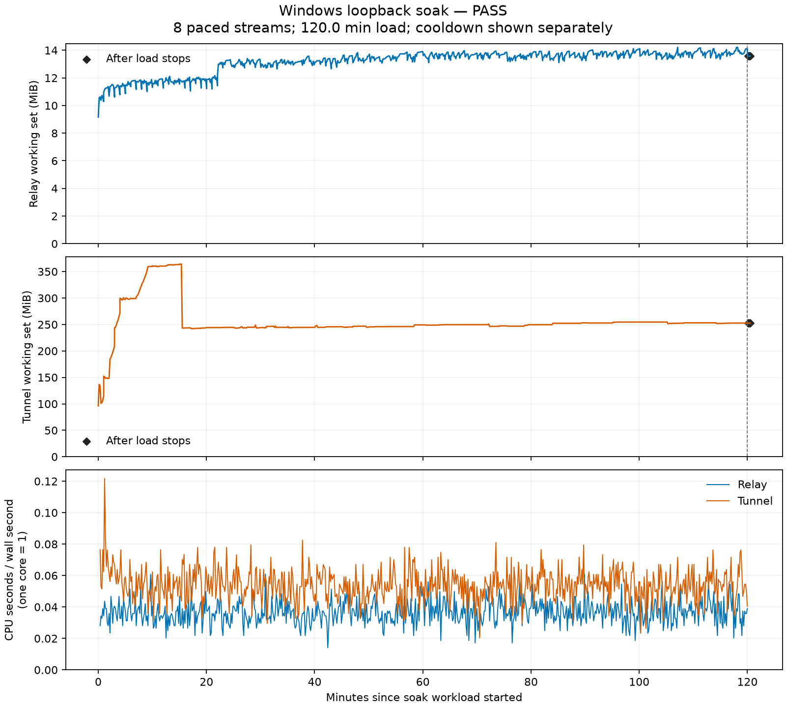

# Windows loopback release benchmark — 2026-10-08

The updated full campaign, revised fault matrix and actual two-hour paced soak **passed**. The soak completed 960 byte-exact stream transfers with zero recorded workload failures. The original full baseline failed on the direct path; that reset remains unexplained and is retained. Memory review found small positive working-set trends after warm-up, so this report does not claim absence of leaks, a speedup, WAN performance or player capacity.

## Method and provenance

The [benchmark procedure](../../benchmarking.md) contains build/run commands, release flags and the topology diagram. The [baseline manifest](results/baseline/build-manifest.json), [candidate build manifest](results/candidate/build-manifest.json), [full measurement manifest](results/candidate/measurement-manifest.json) and [fault/soak manifest](results/candidate/observation-manifest.json) identify the actual frozen inputs. Reported hashes cover file bytes, so checkout line-ending differences can change a Python harness hash without changing its Git source revision. CI artifacts were built on their own runner and remain separate evidence.

The local machine ran Windows 11 build 26300, x86-64, an Intel Core i9-10900K @ 3.70 GHz (10 physical / 20 logical cores), approximately 15.76 GiB usable RAM, Java 21.0.12.1 and Python 3.14.6, on AC power with Ultimate Performance enabled and AC standby idle disabled. Measurements run on a normal desktop from a OneDrive checkout, rather than a dedicated laboratory host; no controlled external network is involved. The initial baseline overlapped a few short Python unit-test batches early in the campaign, with no concurrent release builds. The fixed full run has no concurrent builds, tests or benchmark profiles. The retained build manifests record release commands, source revisions and SHA-256 hashes. Containing-checkout revisions reported in the original benchmark can be dirty because edits occurred after the frozen baseline artifacts were built; the baseline build manifest identifies clean source `5e04359fae7b1bbe2be2104f5e61a2f3980fd12a`. Candidate transport source is `70adbce3c274ebe0a19f27bdf4cfa4e647cba239`; full-run observability harness source is `b7961e1c87d953a28818a9a78bb0223a2d3ceb5d`. Consult both build and measurement manifests rather than inferring build provenance from an artifact's location.

Direct topology: Python guest TCP socket → Python echo service. Relayed topology: guest TCP socket → release Rust relay → native QUIC → shaded Java tunnel → the same echo service. Recovery tests additionally place a benchmark-owned, zero-replay-queue UDP bridge between relay and tunnel. Every address is loopback. No game, world, third-party relay or WAN traffic is involved. The benchmark configuration allows 10,000 accepts/minute to avoid production admission limits shaping synthetic workloads.

Latency cases use 1 and 8 concurrent streams, 1 KiB / 64 KiB / 1 MiB payloads, request-response and TCP half-close modes. Full runs use five warmup waves and thirty measured waves per case; smoke uses one and three respectively. Direct/relay order alternates. Time measures transaction completion, including connection, request, byte verification and reply EOF. Report direct/relay sample counts, p50 and p95. Paired delta is relay minus direct for matching wave/stream samples; its p95 is calculated over differences and is not the difference between two p95 values. p99 is exploratory. Individual stream samples within a concurrent wave are not independent repetitions.

Throughput uses a deterministic seed of 1701 and repeated 64 KiB blocks. Full workloads target five 60-second runs per path at each concurrency; smoke targets one two-second run. Guest-send and echoed-receive byte totals are reported separately and verified against content and EOF. The echo workload's two directions must not be summed into an independent full-duplex capacity claim. Completed runs, partial successes, failure categories and attempted/completed/failed denominators are retained. Schema 9 starts the sending-duration clock inside the sender thread; schema 8 started it before connection setup. The corrected harness also bounds drain time even if a peer continues sending data. These measurement changes further limit historical before/after comparisons.

## Deterministic transport regression and checks

The regression holds the local TCP connection pending and delivers another QUIC payload buffer. The original handler closes the stream on that second read: [before XML](results/regressions/pending-connect-before.xml) records one test and one failure, “a second read during connect must not close the stream.” The final handler retains pending payload until the local connection handoff and bounds it at **2 MiB**, matching existing stream receive credit. Error, cancellation and rejected handoff paths release buffers and close the local socket. This is a bounded pending-connect fix; it does not change protocol versions or increase QUIC credit.

[Final handler XML](results/regressions/pending-connect-final.xml) records seven tests, zero failures and zero errors. The broader Java check records 124 tests: **120 passed, four skipped**, zero failures/errors ([Java totals](results/java-tests.json)). The full-workload Python validation records **53 passed** ([output](results/python-tests-final.txt)); the revised fault-observation suite records **60 passed in 9.108 seconds** ([output](results/python-tests-observation.txt)). Remote Windows CI `cargo test --locked --all` records **46 Rust tests passed**, zero failed/ignored ([retained log excerpt](results/rust-ci-tests.txt), [structured CI validation](results/ci-validation.json)); its four nonempty suites contain 6, 3, 25 and 12 tests. The deterministic regression establishes the handler defect separately from the observed direct TCP failure below.

## Retained original failure and isolation

A baseline Python check failed before the harness changes: **18 of 19 tests passed**, while a 20 ms diagnostic send observed zero guest bytes ([recovered original output](results/regressions/python-baseline-failure.txt)). The original timer included connection/thread startup, allowing startup delay to consume that short sending window. The corrected timer starts in the sender thread, with a delayed-start regression and an explicit nonzero-transfer check. The failure output establishes the zero-byte result; it does not quantify how much concurrent build activity contributed.

The original release smoke passed ([JSON](results/baseline/smoke.json)). The original full campaign **failed** after **553.765 seconds**, during concurrency 1, run index 4, **direct** throughput. That stream ran **42.326 seconds** before `ConnectionResetError [WinError 10054]`, with guest sent **33,076,674,560 bytes** and guest received **33,076,281,344 bytes** ([redacted published failure copy](results/baseline/full.json), [summary](results/baseline/full.md)). Its echo service also recorded a reset. The failing path bypassed relay and tunnel, so this observation does not establish a relay-specific transport failure or demonstrate that the pending-connect fix remedies that reset. Published archives scrub private paths and hostnames; the original outputs are preserved locally. Earlier completed baseline data remains retained; the campaign must not be presented as a completed full baseline.

A separate direct-only diagnostic launched no relay or tunnel subprocesses and repeated five 60-second, single-stream runs with the same seed/block size, byte checks and EOF checks. It **passed 5/5 runs**, with zero failed transfers, in **300.440 seconds** ([JSON](results/direct-diagnostic.json)). Per-stream progress counters, bounded echo events and exception evidence are retained. This repeat did not reproduce the reset; it does not explain the original reset or erase its failure.

## Completed candidate smoke and CI

Local candidate smoke **passed** in **110.582 seconds**, with zero workload failures ([JSON](results/candidate/smoke.json)). Relay restart recovered the old endpoint after approximately **36.370 seconds**. Tunnel process restart re-registered in **568.475 ms** and changed the endpoint, as expected for new in-memory state. A scheduled 55-second UDP drop recovered the bridge-backed endpoint approximately **3.055 seconds after the gate restored**, verified by an exact-byte probe. These smoke outcomes do not substitute for full-duration or existing-stream fault validation.

Recovery retries are recorded separately from workload failures: local relay restart had 17 probe attempts (one completed, sixteen transient failures), and UDP recovery had fourteen (one completed, thirteen transient failures). CLI retry counters record observed retry attempts, not completed reconnects; registration/session counters are also not reconnect counts. Expected unsuccessful probes during a deliberate outage do not become successful transfer measurements.

The relay's exit code **1** is retained: the harness deliberately terminates the relay process. Its cleanup boolean means termination completed, not a graceful zero exit. Tunnel CLI shutdown exited **0**. Raw exit records and cleanup errors take precedence over loose “clean shutdown” wording.

[CI run 37706673912](https://github.com/Kxnar/bta-anywhere/actions/runs/37706673912) succeeded at observability revision `b7961e1`. Its Java/native QUIC, Rust relay, Windows integration and attribution jobs all passed ([run metadata](results/ci-run.json)). CI smoke also passed ([JSON](results/ci/ci-smoke.json)) on a **different machine**: Windows Server build 26100, four logical AMD cores, Rust 1.85.0 and Python 3.12.10. Do not combine CI/local timing or throughput samples. CI UDP recovery succeeded via exact-byte endpoint probe without a retained resume-log event; availability was observed 3.625 seconds after gate restoration, while the longer completion field includes waiting for log observation.

CI at observation revision `4717790` subsequently **failed during startup**, before any transfer, when Windows denied the relay's QUIC UDP bind with error 10013 ([failed JSON](results/ci-observation/ci-smoke.json), [CI validation](results/ci-validation-observation.json)). The relay exited 1; the harness waited for readiness and recorded a timeout. All preceding jobs/checks, including 46 Rust tests and the 60-test benchmark suite, passed. The failure is retained independently of the earlier successful CI run.

The harness had selected both QUIC and admin ports by checking TCP availability. Revision `800bdcc` requests an OS-allocated UDP port for QUIC, keeps TCP allocation for TCP listeners, bounds port-exclusion attempts and detects a relay that exits during startup. This addresses the verified protocol-selection flaw; the precise Windows reservation state responsible for the observed denial was not captured. The allocation probe does not reserve the port until child startup, and any launch failure still fails the run without hidden retries. The local full/fault/soak measurements retain their frozen harness hashes; their workload and binary inputs were not changed during execution.

[CI run 37709933380](https://github.com/Kxnar/bta-anywhere/actions/runs/37709933380) passed all four jobs at `800bdcc`, including the **63-test benchmark suite** (three new startup regressions) and a complete **127.832-second smoke run** ([validation](results/ci-validation-udp-allocation.json), [smoke JSON](results/ci-udp-allocation/ci-smoke.json)). Smoke recorded zero workload failures and all owned processes stopped. UDP availability was verified 2.390 seconds after gate restoration; the longer 59.393-second completion field includes an unsuccessful wait for a resume-log event. These remain separate CI-runner observations, not pooled local measurements. No local tests or builds ran during the soak.

## Candidate full workloads — passed

**PASS**, **1,339.399 seconds**, final harness source `b7961e1` ([JSON](results/candidate/full.json), [generated summary](results/candidate/full.md), [measurement manifest](results/candidate/measurement-manifest.json)). All twelve latency cases and all twenty throughput runs completed. There were zero recorded workload failures, byte mismatches, missing EOFs, timeouts or leaked-active-gauge failures; the final active-connection gauge was zero. This records these checks in this run and does not establish absence of memory leaks. The original full baseline remains failed, so no completed before/after campaign speedup is claimed.

Latency: five warmup waves excluded, thirty measured waves per case. Each row has the stated n for **each path and its paired deltas**: thirty individual transactions at concurrency 1, or 240 at concurrency 8. Across all cases, each path completed 1,620 measured and 270 warmup transactions. Milliseconds are rounded to two decimals; unrounded samples and exploratory p99 values remain in JSON.

| Streams | Payload | Mode | n per path / paired delta | Direct p50 / p95 ms | Relay p50 / p95 ms | Paired delta p95 ms |
|---:|---:|---|---:|---:|---:|---:|
| 1 | 1 KiB | request-response | 30 | 14.64 / 15.68 | 16.48 / 17.85 | 15.72 |
| 1 | 1 KiB | half-close | 30 | 15.60 / 15.81 | 15.69 / 16.66 | 14.14 |
| 1 | 64 KiB | request-response | 30 | 15.19 / 15.83 | 18.42 / 44.58 | 42.22 |
| 1 | 64 KiB | half-close | 30 | 14.47 / 15.40 | 17.11 / 26.05 | 17.73 |
| 1 | 1 MiB | request-response | 30 | 20.00 / 41.07 | 34.43 / 47.56 | 32.03 |
| 1 | 1 MiB | half-close | 30 | 18.96 / 37.01 | 32.78 / 44.60 | 35.55 |
| 8 | 1 KiB | request-response | 240 | 1.96 / 2.52 | 2.58 / 3.12 | 1.36 |
| 8 | 1 KiB | half-close | 240 | 1.97 / 2.81 | 2.46 / 2.91 | 1.25 |
| 8 | 64 KiB | request-response | 240 | 2.23 / 2.77 | 9.87 / 12.73 | 10.78 |
| 8 | 64 KiB | half-close | 240 | 2.15 / 2.60 | 10.00 / 12.46 | 10.24 |
| 8 | 1 MiB | request-response | 240 | 26.37 / 30.23 | 159.63 / 194.12 | 166.71 |
| 8 | 1 MiB | half-close | 240 | 23.48 / 28.56 | 166.94 / 202.59 | 179.69 |

Throughput: deterministic 64 KiB repeated-block echo, five 60-second runs for each row. Rates aggregate concurrent streams using the longest stream completion time, including drain and EOF verification. The median is over **five run-level observations**; forty completed streams at concurrency 8 are not forty independent throughput runs. Both verified directions have identical byte totals/rates in this run. Each path completed 45 throughput streams in total.

| Streams | Path | Runs | Completed streams | G→H median MiB/s | H→G median MiB/s | Run range per direction MiB/s |
|---:|---|---:|---:|---:|---:|---:|
| 1 | direct | 5 | 5 | 788.80 | 788.80 | 740.50–808.09 |
| 1 | relay | 5 | 5 | 59.34 | 59.34 | 59.04–62.17 |
| 8 | direct | 5 | 40 | 1409.77 | 1409.77 | 1343.55–1446.79 |
| 8 | relay | 5 | 40 | 24.68 | 24.68 | 24.32–24.78 |

The eight-stream relay aggregate median was lower than its single-stream median (24.68 versus 59.34 MiB/s) under this loopback echo workload. Report these measured rates as observed; they are not a capacity scaling result, WAN estimate or performance improvement.

Post-workload recovery checks passed: relay restart restored the old endpoint in 46.849 seconds (22 probe attempts, 21 transient failures); tunnel process restart re-registered with a new endpoint in 566.581 ms; a scheduled 55-second UDP interruption restored the retained bridge-backed endpoint 2.346 seconds after gate restoration (11 probe attempts, ten transient failures). Five CLI retry attempts were observed across the campaign, which is a distinct counter from both probe retries and completed reconnections.

Owned-process archival records both relay generations and the deliberately terminated original tunnel with exit 1, followed by the final CLI tunnel exit 0. All were stopped at completion. CPU/memory observations are retained in JSON; the soak below covers memory review and prolonged stability.

## Supplemental fault cases — revised sequential repeats passed

The first supplement failed on **both** original and fixed tunnel builds ([original](results/baseline/faults.json), [fixed](results/candidate/faults.json)). Both completed eight slow receivers and fresh post-restart recovery, but the harness forced the old socket closed after about ten seconds and then allowed only ten seconds for the relay gauge to drain. That verdict preceded the relay's verified 30-second QUIC idle timeout. The active gauge subsequently reached zero. This is a reproduced observation-window defect, not evidence of a permanent transport leak; the original failed records are retained.

The initial candidate fault run overlapped a separate intentional cancellation probe for 2.493 seconds (00:34:16.952–00:34:19.445 UTC). This overlap did not affect the full campaign. The corrected fault repeats ran sequentially without that extra workload.

The correction records natural EOF/reset, observation expiry and forced local closure separately, with a configurable 90-second default observation limit. Expiry or an unexpected local error still fails the case. Natural termination after tunnel-process kill and UDP interruption is distinct from success of a fresh request; existing relay-process stream survival is not measured by this supplement. The revised baseline and candidate supplements both passed, sequentially, with the results below. The existing streams did not survive; natural early EOF is the expected recorded fault outcome, while fresh byte-exact recovery is a separate success.

The observation correction is source `4717790f3154f23a8dd8c6a080d54b06dadb6dbc`, using frozen fault harness SHA-256 `ff8372a6dec5fdc6228d66e54d808bd13e6a4a4067f1cd689d522770ea19e3cf` ([observation manifest](results/candidate/observation-manifest.json)). The manifest records tracked source clean; containing-checkout dirty flags include untracked publication copies and do not identify the binary build. Baseline and candidate use their separately recorded frozen artifact hashes. No extra tests, builds or benchmark profiles overlapped these revised repeats.

Eight slow receivers each verified **1 MiB** and reply EOF: eight successful transfers out of eight attempts per build. They requested an actual 4 KiB receive buffer, read 4 KiB chunks and delayed 10 ms between reads. The following working sets are **before / largest sampled / immediately after**, in MiB; periodic samples are taken during this roughly three-second burst, not a prolonged leak test.

| Build | Completed slow transfers | Stream duration range s | Relay WS before / sampled max / after MiB | Tunnel WS before / sampled max / after MiB | Final active gauge |
|---|---:|---:|---:|---:|---:|
| baseline | 8/8 | 2.950–2.971 | 9.07 / 19.28 / 11.74 | 95.66 / 179.45 / 164.94 | 0 |
| candidate | 8/8 | 2.924–2.944 | 9.06 / 18.23 / 10.57 | 96.80 / 170.38 / 170.38 | 0 |

Existing-stream rows below each verified one 4 KiB exchange before fault injection, then attempted one more exchange. That second exchange failed with early EOF after zero reply bytes; post-fault verified bytes were zero. No old socket was forced closed by the observer, and natural termination occurred before the bounded observation deadline. The process-kill deadline is 90 seconds from onset; UDP observation is rebased to 90 seconds after forwarding-gate restoration.

| Build | Fault | Old stream natural terminal from onset s | Fresh 64 KiB + EOF from onset s | Fresh from gate restoration s | Fresh attempts / successes / failed | Endpoint retained | Final active gauge |
|---|---|---:|---:|---:|---:|---|---:|
| baseline | tunnel process kill | 30.016 | 0.579 | 0.031 | 1 / 1 / 0 | no | 0 |
| baseline | 55 s UDP drop | 30.014 | 56.944 | 1.944 | 10 / 1 / 9 | yes | 0 |
| candidate | tunnel process kill | 30.017 | 0.575 | 0.029 | 1 / 1 / 0 | no | 0 |
| candidate | 55 s UDP drop | 30.010 | 56.966 | 1.965 | 10 / 1 / 9 | yes | 0 |

The process-kill gate column starts when the restarted tunnel endpoint is available; the UDP gate column starts at the scheduled forwarding restoration. A fresh endpoint can therefore recover before the old connection naturally terminates. Baseline and candidate observed approximately 30-second old-stream termination; both retained the endpoint through UDP recovery and changed it after starting a fresh tunnel process. The timestamps distinguish natural old-stream termination from waiting for the outage to end and a new request to complete.

Per build, the explicitly scoped count is **19 attempts, ten successes, nine failed attempts**: eight successful slow transfers, one successful process-recovery probe, then ten UDP recovery probes (one success and nine transient failures). Existing-stream exchanges and internal setup probes are recorded separately. Across the two deliberate faults each build records four existing-stream exchange attempts, two pre-fault completions and two expected post-fault early-EOF failures. These expected failures and retry attempts remain visible despite the scenario-level PASS verdict ([baseline JSON](results/baseline/faults-observed.json), [candidate JSON](results/candidate/faults-observed.json)).

The revised supplement lasts approximately 93 seconds per build. Its sampled working-set rise is an observation, not proof of bounded long-term memory growth or a production capacity limit. There is **one complete updated local full campaign**. Three complete campaigns on separate occasions were not performed, so between-occasion variability remains unmeasured. No WAN or game/player workload was measured.

## Cancellation and failure cleanup

An intentional `KeyboardInterrupt` was injected after one successful 64 KiB byte-exact half-close transaction ([JSON](results/candidate/cancelled.json)). The harness exited 1 and preserved a **FAILED** result with that explicit cause, no cleanup errors, and both owned processes stopped. The relay exited 1 through deliberate termination; the tunnel exited 0. This planned failure verifies cancellation evidence and cleanup; it is not counted as an ordinary workload success. The failed baseline full run also retains cleanup and bounded echo diagnostics.

## Two-hour soak — passed and reviewed

The soak ran from **00:43:35.730 to 02:44:07.798 UTC**, with **7,200.233 seconds of load**, **30.023 seconds of cooldown**, and **7,232.068 seconds overall** ([JSON](results/candidate/soak.json), [generated summary](results/candidate/soak.md)). Eight concurrent streams sent deterministic 64 KiB blocks at 0.5-second pacing, in waves of up to 60 seconds. It completed **120 waves / 960 successful stream transfers**, with **7,537,164,288 verified bytes (7.0195 GiB) in each direction**. This is paced echo traffic, approximately 1 MiB/s per direction in aggregate; the two directions must not be added together as independent throughput. These were repeated connection waves, not eight persistent TCP connections held for two hours.

Recorded failed transfers, byte mismatches, missing EOFs, timeouts, leaked-active-gauge failures and observed CLI retry attempts were all **zero**. All **843 process/metric samples** succeeded. The final active-stream gauge was **zero**, both owned processes stopped, and no cleanup errors were recorded. The relay's deliberate termination returned 1; the tunnel's orderly shutdown returned 0.



The following values come from the retained samples and [derived analysis](soak-memory.analysis.json). Working set is resident process memory, not a measurement of live allocations. The post-warm-up fit uses samples from 15 minutes through load completion; its slope is descriptive and has no confidence interval. CPU totals subtract the pre-load sample from the final sample and include cooldown.

| Process | Before load MiB | Largest sampled MiB | Median after 15 min MiB | Final 10 min load median MiB | After cooldown MiB | Post-15-min slope MiB/hour | CPU seconds during observation |
|---|---:|---:|---:|---:|---:|---:|---:|
| Rust relay | 9.16 | 14.21 | 13.54 | 13.81 | 13.57 | +0.78 | 263.61 |
| Java tunnel | 96.22 | 364.20 | 249.02 | 252.75 | 252.75 | +4.64 | 390.19 |

The OS-reported peak working sets were 14.21 MiB for the relay and 373.88 MiB for the tunnel; these can exceed the largest periodic sample. The tunnel's largest sampled working set was around 364 MiB during its initial rise, then fell near 243 MiB around minute 15. Both processes showed smaller positive trends afterward. All three cooldown samples retained approximately 13.57 MiB for the relay and 252.75 MiB for the tunnel. The short cooldown did not return either process to its initial working set. The graph and active-stream checks support successful completion of this workload; they cannot distinguish retained allocator/JVM capacity from a small leak. Longer runs with allocation or heap profiling would be needed for that attribution. No leak-free claim is made.

This section completes the manual memory review. The immutable raw JSON retains its automatic `PENDING_MANUAL_REVIEW` marker; it has not been rewritten to imply the harness performed this interpretation. Reproduce the plot with Python, matplotlib and numpy:

```powershell
python docs/benchmarks/2026-10-08/plot_soak.py --input docs/benchmarks/2026-10-08/results/candidate/soak.json --output docs/benchmarks/2026-10-08/soak-memory.png
```

## Evidence archive and reproduction

The [campaign inventory](results/campaign-index.json) keeps separate outcomes for all measured runs, including the failed baseline, both premature fault verdicts, deliberate cancellation and failed CI startup. Original local outputs remain unchanged under ignored `benchmark-results/2026-10-08/`. Published copies normalize UTF-8/LF, trim trailing log whitespace and redact workstation paths, local execution identifiers and JUnit hostnames. The [archive index](archive-index.json) records original and published SHA-256 values. Numerical results and pass/fail outcomes are unchanged; final sample series supersede the retained local checkpoint. Intermediate five-test transport output is historical; the seven-test final XML is the regression evidence for the published transport fix.

The [fault observation diagnosis](fault-observation.md) explains the corrected observation window. The [cancellation probe](cancellation_probe.py) can be run from the repository root with the same benchmark binary/JAR/output arguments; its expected result is an explicitly retained FAILED record with `KeyboardInterrupt`. The [archive script](archive_evidence.py) documents publication transformations. Full build and workload commands are in the [procedure](../../benchmarking.md); use the recorded source revisions and manifests to reproduce this campaign's frozen inputs.

The final transport implementation is covered by Java checks and the deterministic pending-connect regression. Later harness-only changes were validated by remote CI without adding local build/test load to the soak. Only one complete updated local full campaign and one two-hour soak were run. No separate-host network study or actual game/world smoke test was performed.

## Concise CV claim candidates

- Built Java/Rust relay hosting for Better Than Adventure.
- Fixed pending-connect payload loss with bounded buffering and regressions.
- Verified loopback recovery and a two-hour paced, eight-stream soak.

These three short bullets cover the project, diagnosed improvement and measured scope. They do not claim a throughput improvement, internet scale or leak-free operation.
