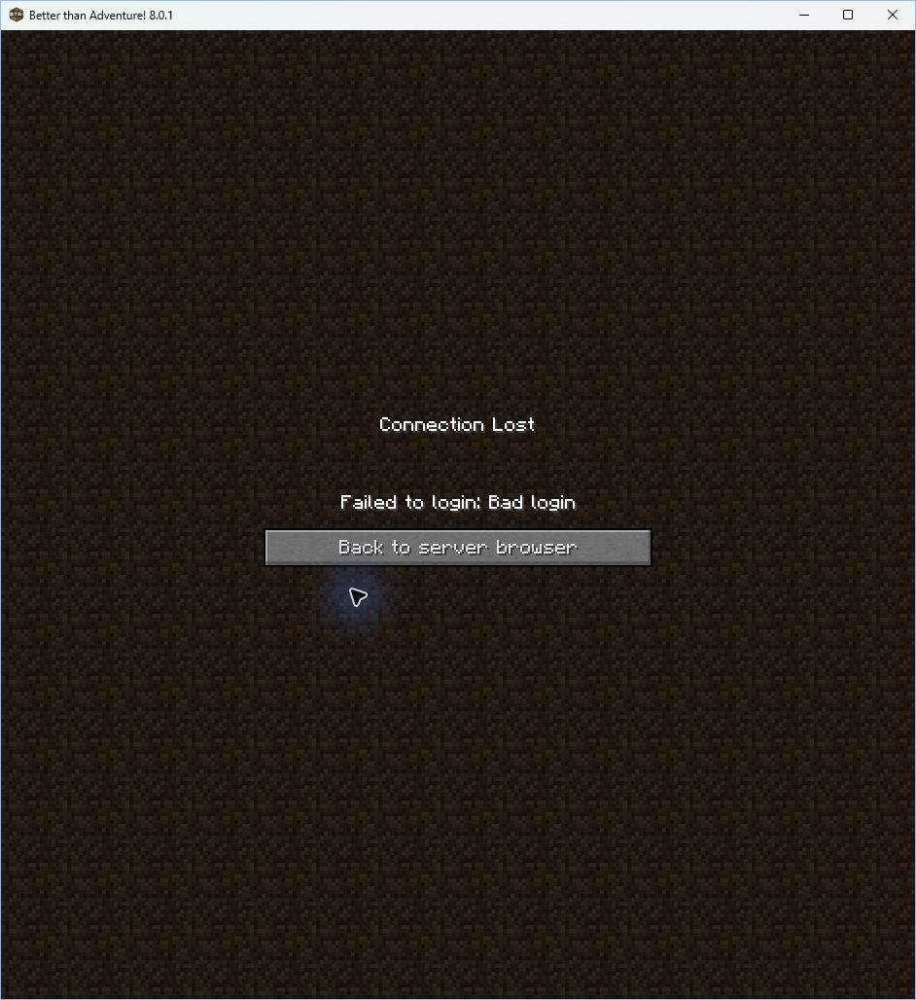

# First multiplayer journey attempt

Two BTA 8.0.1 development clients launched in separate disposable game directories.
The host created a new world and used **Host World** to start the dedicated server.
Its automatic local join failed with **Failed to login: Bad login** because the
development session was unauthenticated. This is a retained failed attempt,
not a completed multiplayer demonstration.

## Setup and observations

The checkout started at `7444976`. The machine ran Windows x86-64 and Microsoft
OpenJDK 21.0.12.1. The launch used Loom's resolved client classpath, native libraries,
and launch configuration, with explicit `--gameDir` and `--username` arguments.
The two fresh directories were named `DemoHost` and `DemoGuest`; neither reused
the existing PrismLauncher instance or its saved worlds. The exported launch
specification contains no authenticated session. Do not publish real session
arguments when repeating with signed-in clients.

1. Resolving the documented development-client runtime failed: Bouncy Castle
   `bcpkix`, `bcprov` and `bcutil` 1.86 were missing from the mod's
   `runtimeClasspath` lock state. The retained [original failure](results/prepare-failed.txt)
   identifies all three entries.
2. Adding those three existing dependency versions to `runtimeClasspath` allowed
   both clients to launch. No dependency version changed. A new
   `:bta-mod:checkClientRuntime` task is attached to `check`, because the previous
   compile/test configurations did not exercise this runtime configuration.
3. The host created **New World** in its disposable directory with the generated
   seed `-4214769723876029165`. It selected live-world hosting, LAN mode, whitelist
   enabled, invited username `DemoGuest`, eight player slots, 2048 MiB server heap
   and TCP port 25565. These settings describe this attempted setup; eight slots
   are not evidence of eight-player capacity.
4. The hosting screen downloaded the official pinned BTA 8.0.1 Babric server
   archive. The installed distribution marker records SHA-256
   `18a8dc132e9c08f9cc6928ac00cd05d2d9450fd98cb26eb8fb732455bf9011f4`.
   The server reached its `Done` message, then the host attempted `127.0.0.1:25565`.
5. The host received the authentication failure shown above. The managed server
   logged shutdown and chunk saving. Both test clients were closed, and a final
   check found neither client process nor a listener on port 25565. The guest
   remained at its title menu and never joined. Playing and reconnecting were
   not attempted after the authentication failure.

The server configuration retained `online-mode=true` and `white-list=true`.
The test does not establish that legitimate authenticated logins work. It also
does not establish world restoration after shutdown; reopening the world remains
part of the successful-journey checklist.

## Repeating the successful journey

Use two signed-in BTA 8.0.1 clients in separate game directories, with the required
loader, HalpLibe and built BTA Anywhere mod. Keep their session credentials local.
Create a fresh disposable world and invite the second account's exact username.
Capture host settings, server-ready state, both players in the same world, a
shared block change observed by the other player, guest disconnection, and a
successful rejoin that still sees the change. Stop hosting and reopen the world.
Repeat joining through the self-hosted relay and identify the topology in the
recording. A LAN-only recording cannot establish relay multiplayer functionality.

The [launch export script](source/demo-launch.init.gradle) and
[isolated launch script](source/launch-demo.py) retain the local development setup
used for this failed attempt. They are diagnostics, not an authenticated launcher.
The screenshots are a sequence of observed states, not a video of successful play.

## Evidence

`manifest.json` records hashes of the archived files and measured class/JAR
inputs. Logs and the launch specification replace absolute home/workspace paths
with placeholders. The locally retained world, binaries and unredacted logs live
under ignored `.local/game-demo-2026-10-08/`; they are not bundled with the report.
The archive verifier checks the published byte hashes.

The original lockfile was also restored temporarily to test the new verification
task: it failed on the same three omissions. The fixed lockfile was restored
before the final checks. Exact command outcomes are recorded in
`results/checks.json`; unfinished or failed checks must not be called passes.
